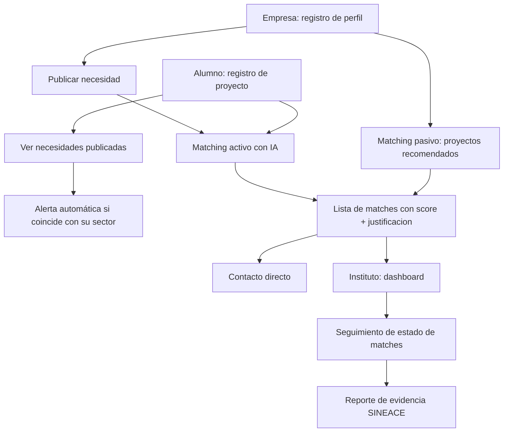

# FLUJO — Plataforma de Vinculación Academia-Industria

Mapa de flujos de usuario por perfil (Empresa, Alumno, Instituto), basado en el PRD v1.0.

---

## Mapa general (vista rápida)

---

## Flujo 0 — Onboarding (común a los 3 roles)

1. Usuario entra a la landing → botón "Crear cuenta".
2. Selecciona su rol: **Empresa**, **Alumno** o **Instituto**.
3. Completa formulario según rol:
   - **Empresa:** nombre, rubro(s), ubicación, tamaño, contacto.
   - **Alumno:** nombre, instituto, carrera, correo.
   - **Instituto (directivo):** nombre, cargo, instituto que representa.
4. Confirma → es redirigido a su dashboard correspondiente.

---

## Flujo 1 — Empresa: descubrimiento pasivo (por perfil)

1. Empresa inicia sesión → dashboard.
2. El sistema muestra "Proyectos recomendados para ti" (matching automático según su rubro).
3. Empresa hace clic en un proyecto → ve la ficha completa (información general, datos de innovación, beneficios concretos, resultados/indicadores).
4. Empresa pulsa "Contactar" → se abre el canal de contacto con el instituto/alumno autor.

## Flujo 2 — Empresa: publicar una necesidad (matching activo)

1. Empresa → "Publicar necesidad" (formulario corto, 3 pasos).
2. Paso 1: rubro/categoría del problema.
3. Paso 2: descripción libre del problema.
4. Paso 3: tipo de apoyo que busca (piloto, conocimiento, mano de obra técnica).
5. Publica → el motor de matching con IA se ejecuta automáticamente.
6. Los alumnos cuyo sector coincide reciben una alerta (ver Flujo 5).
7. Empresa ve una lista de proyectos sugeridos, cada uno con score de compatibilidad y justificación en lenguaje natural.
8. Empresa contacta a uno o varios autores.

## Flujo 3 — Empresa: explorar el catálogo general

1. Empresa → "Catálogo de proyectos".
2. Filtra por sector y/o etapa del proyecto.
3. Abre la ficha de un proyecto.
4. (Si el alumno lo activó) ve también su CV/perfil.
5. Contacta directamente.

## Flujo 4 — Empresa: caja de sugerencias *(P1)*

1. Empresa → "Dejar una sugerencia" (campo libre, sin formulario formal).
2. La sugerencia llega únicamente al instituto (no es pública).
3. El instituto puede convertirla en una necesidad formal o en un tema sugerido de proyecto.

---

## Flujo 5 — Alumno: registrar un proyecto

1. Alumno inicia sesión → dashboard.
2. "Registrar nuevo proyecto" → formulario (título, sector, problema que resuelve, etapa, descripción/archivo).
3. *(P1)* Si el instituto tiene rol de curador, el proyecto queda en estado "pendiente de validación".
4. Proyecto publicado → visible en el catálogo y disponible para el matching.

## Flujo 6 — Alumno: ver necesidades y recibir alertas

1. Alumno → "Necesidades publicadas" (catálogo de necesidades de empresas).
2. Filtra por sector.
3. Si se publica una necesidad relacionada a su carrera/sector, recibe una notificación automática (push/email).
4. Puede usar esa necesidad como tema de su próximo proyecto.

## Flujo 7 — Alumno: ver proyectos de otros estudiantes

1. Alumno → "Proyectos de la comunidad".
2. Busca/filtra por sector o palabra clave.
3. Ve la ficha de un proyecto ajeno (sin datos de contacto privados, salvo que el autor los haya hecho públicos).
4. Puede dar continuidad a un proyecto de una generación anterior.

---

## Flujo 8 — Instituto: vista global y seguimiento

1. Directivo inicia sesión → dashboard institucional.
2. Ve métricas generales: n.º de proyectos, necesidades y matches activos.
3. Entra a "Matches" → ve la lista completa con su estado actual.
4. Actualiza el estado de un match: contactado → en validación → piloto → adoptado/descartado.
5. *(P1)* Aprueba o rechaza un proyecto/necesidad antes de que se publique.

## Flujo 9 — Instituto: generar evidencia para SINEACE/CONEACES

1. Directivo → "Reportes / Evidencia".
2. Selecciona el rango de fechas o periodo de acreditación.
3. El sistema genera un reporte con los indicadores clave (proyectos con seguimiento, matches generados, adopciones confirmadas).
4. Exporta el reporte (PDF/Excel) para anexarlo al proceso de autoevaluación.

---

## Notas para UI/UX y BACKEND

- Los Flujos 1, 2 y 3 comparten el mismo componente de "ficha de proyecto" — diseñarlo una sola vez y reutilizarlo.
- El Flujo 6 (alertas) depende de que el perfil del alumno tenga un campo de sector/carrera bien definido desde el onboarding (Flujo 0) — es el dato que dispara la notificación.
- El Flujo 9 depende de que cada match tenga un historial de estado con fecha (Flujo 8) — sin eso no hay evidencia trazable que reportar.
