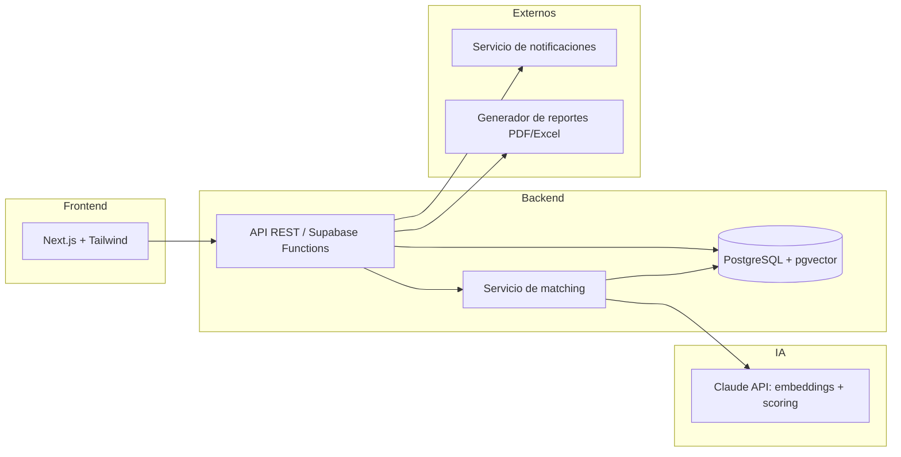
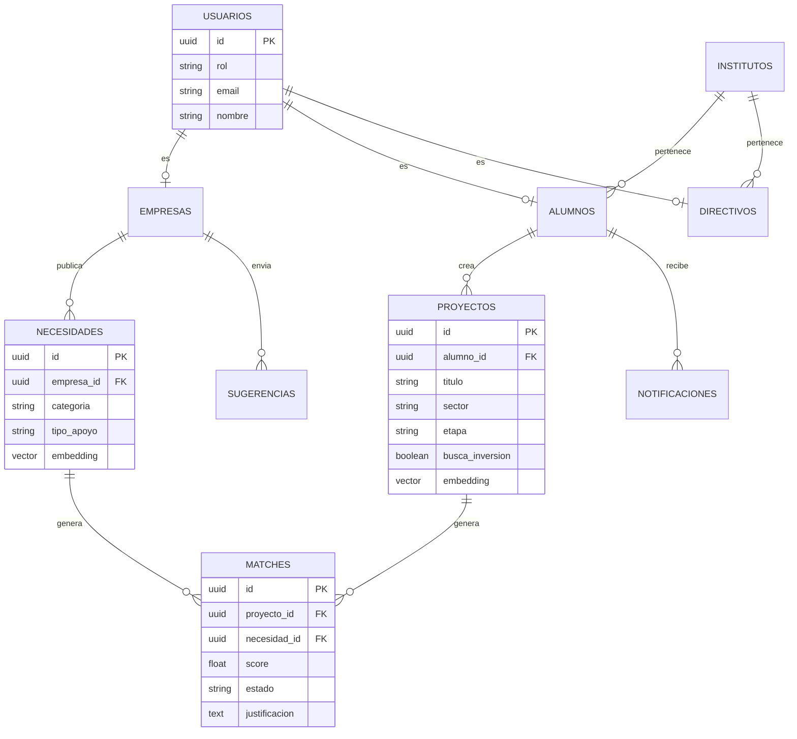

# TRD — Plataforma de Vinculación Academia-Industria

Requisitos técnicos derivados del PRD, FLUJO y UI/UX. Pensado para construcción rápida tipo hackathon (vibe coding), con un modelo de datos que escala sin rehacerse si el piloto crece.

---

## 1. Arquitectura general

## 2. Stack tecnológico

| Capa | Elección | Por qué |
|---|---|---|
| Frontend | Next.js + Tailwind CSS | Velocidad de desarrollo, encaja con el sistema de tarjetas/pastel ya especificado en UI/UX |
| Backend / Auth / DB | Supabase (PostgreSQL + Auth + Storage) | Todo-en-uno: auth con roles, base de datos relacional, storage de archivos (CV, evidencias) — minimiza infraestructura a montar en el hackathon |
| Búsqueda semántica | `pgvector` (extensión de Postgres) | Evita levantar una base vectorial aparte; suficiente para el volumen de datos del piloto |
| IA (matching + justificación) | Claude API (Anthropic) | Genera tanto el score como la justificación en lenguaje natural en una sola llamada |
| Notificaciones | Resend (email) o equivalente | Simple de integrar, suficiente para alertas a alumnos |
| Hosting | Vercel (frontend) + Supabase (backend) | Despliegue inmediato, sin servidores que mantener durante el hackathon |

## 3. Modelo de datos

**Notas del modelo:**
- `instituto_id` está presente en `ALUMNOS`, `DIRECTIVOS` y se propaga a `PROYECTOS` — esto es lo que permite escalar a multi-instituto sin rediseñar el esquema (queda fuera de alcance construirlo en v1, pero el modelo no lo bloquea).
- `embedding` en `PROYECTOS` y `NECESIDADES` es lo que habilita el matching semántico.
- `MATCHES.necesidad_id` es nullable: un match puede originarse por matching pasivo (perfil/rubro de la empresa) sin que exista una necesidad publicada.
- `ALUMNOS.cv_visible` (boolean, no graficado arriba por simplicidad) controla si su CV es visible para empresas — default `false` (opt-in).

## 4. Motor de matching con IA

Flujo técnico en dos etapas (recuperación + razonamiento), pensado para mantenerse barato y rápido con pocos datos:

1. Al crear un proyecto o necesidad, se genera un **embedding** del texto combinado (título + descripción + sector).
2. Se calcula **similitud coseno** contra los embeddings del lado opuesto usando `pgvector`.
3. Se seleccionan los **top-5 candidatos** por similitud.
4. Para cada candidato, se hace **una llamada a Claude** con ambos textos (proyecto + necesidad) y se le pide devolver: un score ajustado (0-100) y una justificación en 2-3 líneas en lenguaje natural.
5. El resultado se guarda en `MATCHES`.
6. Si el score supera un umbral configurable (ej. 70), se dispara una notificación al alumno/empresa correspondiente.

Este patrón de dos etapas (embeddings para acotar candidatos + LLM para el score final y la explicación) evita mandar todo el catálogo a la IA en cada match, y es lo que sostiene la promesa de "potenciado por IA" del pitch sin necesitar un modelo propio entrenado.

## 5. API — endpoints principales

| Método | Ruta | Descripción |
|---|---|---|
| POST | `/auth/register` | Registro de usuario (con rol) |
| POST | `/auth/login` | Login |
| GET | `/proyectos` | Catálogo general, con filtros de sector/etapa |
| POST | `/proyectos` | Alumno crea un proyecto |
| GET | `/proyectos/:id` | Ficha de proyecto |
| GET | `/necesidades` | Catálogo de necesidades |
| POST | `/necesidades` | Empresa publica una necesidad |
| POST | `/matching/ejecutar` | Dispara el matching (automático tras crear proyecto/necesidad) |
| GET | `/matches?usuario_id=` | Lista de matches según el rol del usuario |
| PATCH | `/matches/:id` | Instituto actualiza el estado de un match |
| GET | `/instituto/dashboard` | Métricas agregadas |
| GET | `/instituto/reporte?desde=&hasta=` | Reporte exportable de evidencia |
| POST | `/sugerencias` | Empresa envía una sugerencia (buzón) |
| GET | `/notificaciones` | Notificaciones del alumno autenticado |

## 6. Autenticación y permisos (RBAC)

| Rol | Puede ver | Puede crear/editar |
|---|---|---|
| Empresa | Catálogo público, sus propias necesidades, sus matches | Su perfil, sus necesidades, sugerencias |
| Alumno | Catálogo público, necesidades publicadas, sus propios datos | Su perfil, sus proyectos |
| Instituto (directivo) | Todo: proyectos, necesidades, matches de su instituto | Estado de los matches, aprobación de proyectos/necesidades *(P1)* |

## 7. Privacidad y seguridad de datos

- El CV del alumno solo es visible para empresas si `cv_visible = true` (opt-in explícito, default apagado) — consistente con la Ley de Protección de Datos Personales (Ley N.° 29733).
- Llaves de API (Claude, servicios externos) viven solo en el backend — nunca expuestas al frontend.
- Contraseñas gestionadas por el proveedor de auth (Supabase Auth), nunca almacenadas en texto plano.
- Todo tráfico sobre HTTPS.

## 8. Requisitos no funcionales

- **Latencia del matching:** aceptable hasta unos segundos por ejecutarse vía LLM — no es un caso de uso en tiempo real estricto.
- **Escalabilidad:** el piloto es de un solo instituto (Pacarán), pero el modelo de datos ya soporta multi-instituto sin rediseño.
- **Disponibilidad:** no crítica durante el hackathon; si el proyecto continúa, sí lo será para el piloto real.

## 9. Riesgos técnicos y mitigación

| Riesgo | Mitigación |
|---|---|
| Dependencia de un proveedor de IA externo (costos, rate limits) | Cachear embeddings, limitar llamadas por sesión durante la demo |
| Pocos datos semilla reales para que el matching luzca bien | Curar manualmente 5-10 proyectos/necesidades reales para la demo del hackathon |
| Falta de validación legal sobre visibilidad del CV | Queda como pregunta abierta también en el PRD — no bloqueante para el hackathon |

## 10. Fuera de alcance técnico (v1)

- Integración directa con sistemas de SINEACE/CONEACES (no existe API pública conocida).
- Procesamiento de pagos o transacciones.
- App móvil nativa.
- Arquitectura multi-tenant completa (el modelo lo soporta, pero no se construye la capa de aislamiento ahora).
